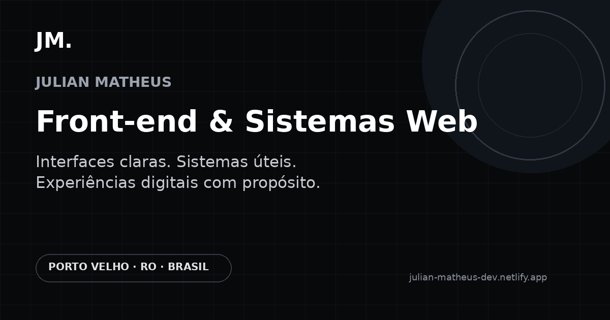

# Julian Matheus — Portfólio

Portfólio profissional desenvolvido para apresentar projetos, experiências, serviços e minha atuação com desenvolvimento front-end e sistemas web.

<p align="left">
  <a href="https://julian-matheus-dev.netlify.app/">
    Acessar portfólio ↗
  </a>
</p>

---

## Preview



---

## Sobre o projeto

O projeto foi construído com foco em identidade visual, responsividade, performance e experiência.

A proposta foi criar um portfólio que não funcionasse apenas como uma página de apresentação, mas como uma experiência digital que representasse minha forma de trabalhar com interfaces e produtos.

Entre os principais elementos estão:

- abertura cinematográfica;
- animações e transições;
- experiência 3D com WebGL;
- projetos apresentados como cases;
- layout responsivo;
- integração com Google Analytics;
- eventos personalizados para acompanhamento de interações;
- Open Graph para compartilhamento;
- favicon e identidade visual própria.

---

## Tecnologias

- TypeScript
- JavaScript
- HTML
- Sass
- WebGL
- Vite
- Google Analytics 4
- Git
- GitHub
- Netlify

---

## Estrutura

```text
perfil-julian-dev/
├─ public/
│  ├─ apple-touch-icon.png
│  ├─ favicon-32x32.png
│  ├─ favicon.png
│  └─ og-image.png
│
├─ src/
│  ├─ analytics.ts
│  ├─ contact.scss
│  ├─ hero.scss
│  ├─ intro-scene.ts
│  ├─ intro.scss
│  ├─ intro.ts
│  ├─ main.ts
│  ├─ projects.scss
│  ├─ scene.ts
│  ├─ services.scss
│  ├─ styles.scss
│  └─ ui.ts
│
├─ index.html
├─ package.json
└─ tsconfig.json
